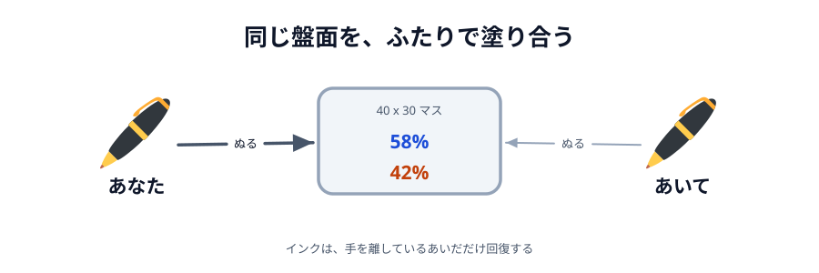

# 02 色塗りバトル



同じ仕組みで、対戦ゲームも作れます。
盤面をマス目に割って、ドラッグしたところを自分の色にする。相手のマスも上から塗れば奪える。
60 秒後に**多く取っていたほうが勝ち**です。

この節は組み立てる形ではありません。**動くものと、その中身をそのまま置いてあります**。
遊んでみて、気になったところだけコードを読んでください。

## あそびかた

1. ふたりで同じあいことばを入れて、片方が「へやをつくる」、もう片方が「へやにはいる」
2. つながると「じゅんびOK」が出る。**ふたりとも押したら**はじまる
3. 3・2・1 のあと、60 秒のバトル
4. 盤面をドラッグすると、ペンの通ったマスが自分の色になる
5. 時間切れで集計。「もういちど」で再戦できる

ホストが青、ゲストが橙です。

## インクのしくみ

ただドラッグし続けるだけだと、速く動かせる人が勝つだけのゲームになります。
そこで**インク**を入れて、「塗る」と「休む」を選ばせるようにしています。

|            |                                          |
| ---------- | ---------------------------------------- |
| 満タン     | 100（この状態から一気に 200 マス塗れる） |
| 1 マス塗る | 0.5 減る                                 |
| 回復       | **手を離しているあいだだけ** 毎秒 30     |
| インクぎれ | 0 になると、30 まで戻るまで塗れない      |

ふつうの速さでドラッグすると、消費は毎秒 45 くらいです。回復が毎秒 30 なので、
**4 割塗って 6 割休む**あたりで釣り合います。塗りっぱなしにはできません。

大事なのは、**空にする前に手を離したほうが得**だということです。
空にすると 1 秒ロックされたうえ、30 ぶん（60 マス）しか持たない状態で再開することになります。
早めに離しておけば 3.3 秒で満タンに戻り、**狙った場所をまとめて奪える**。
ならした塗る速さは同じでも、まとめて塗れるほうが強いのです。

## 動かす

::preview[こちらで「へやをつくる」]{height="620"}

::preview[こちらで「へやにはいる」]{height="620"}

:::warning
上下に並んだこの 2 つでは、**つながることは確かめられても、試合にはなりません**。
塗れるのは一度にどちらか片方だけですし、もう片方は画面の外にあるからです。

ちゃんと対戦するときは、**2 つのウィンドウを左右に並べて**開くか、
[Netlify に公開](../../05-drawing/08-deploy/LECTURE.md)して 2 台の端末で開いてください。
:::

## お絵かきアプリと、どこが違うのか

つなぎ方（`roomId` / `showError` / `ready` / `apply` / `draw`）は 05 章のままです。
変えたのは 4 か所だけで、そこがそのまま「ゲームを作るとき何が増えるか」になっています。

### 送るのは「マスの番号」

盤面は 800x600 を 20px 四方で割った **40x30 = 1200 マス**です。
マスは座標の組ではなく**番号 1 つ**で表します。`index = 行 × 40 + 列` なので、
`grid[index]` がそのままそのマスの持ち主になります。

送る指示はこの形です。`cells` には、そのイベントで**新しく取ったマスだけ**が入ります。

```js
{ type: 'paint', by: 1, cells: [3, 4, 5, 43, 44, 45, 83, 84, 85] }
```

お絵かきの `line` と同じ粒度（1 イベント = 1 指示）なので、`apply` と `draw` の形は変わりません。
すでに自分の色のマスは取らないので、**自分の陣地をなぞっているあいだは 1 通も送りません**。

### `history` を持たない

:::code[`main.js`（盤面の持ち方）]{filepath=main.js offset=36}

```js
// 盤面そのもの。お絵かきアプリの history（指示の記録）の代わりに、
// 「いまどうなっているか」だけを持つ。占有率もここから数える。
const grid = new Array(COUNT).fill(EMPTY);
```

:::

お絵かきの `history` は「再生すると今の絵になる指示の列」でした。
バトルには `grid` があって、こちらは**今の状態そのもの**です。

試合の途中から入ってくる人もいないので、指示を取っておく理由がありません。
`draw` は、お絵かきから `history.push` を削るだけになります。

:::code[`main.js` の `draw`]{filepath=main.js offset=197}

```js
// 自分の画面に当ててから、同じ指示を相手にも送る。
// 「当てる」と「送る」を必ずセットにするので、2 つの画面が同じ動きになる。
// お絵かきアプリと違って history には貯めない。試合の途中から入ってくる人がいないので、
// 指示を取っておく理由がない（いまの盤面は grid が持っている）。
function draw(data) {
  apply(data);

  if (conn) {
    conn.send(data);
  }
}
```

:::

[カーソルの節](../01-cursor/LECTURE.md)では「`draw` を通さず `conn.send` を直接呼ぶ」指示を作りました。
バトルでは**ぜんぶ `draw` を通します**。カーソルは自分の画面を変えない指示でしたが、
バトルの指示はすべて「両方の画面を同じ状態に変えるもの」だからです。

### ホストが審判をする

「じゅんびOK」を押したことは `{ type: 'ready', by: me }` で伝えます。
**だれが押したか**を指示に入れておくと、自分が出しても相手から届いても同じように扱えます。

そろったかどうかはふたりとも分かりますが、**開始を宣言するのはホストだけ**です。

:::code[`main.js` の `startIfBothReady`]{filepath=main.js offset=209}

```js
// 開始を決めるのはホストだけ。ふたりが別々に「そろった」と判断すると、
// 始まった時刻がずれて、のこり時間も食い違う。
function startIfBothReady() {
  if (me !== HOST) return;
  if (hostReady === false || guestReady === false) return;

  draw({ type: 'start' });
}
```

:::

:::notice
`{ type: 'start', at: Date.now() + 3000 }` のように「何時にはじめる」と**時刻を送ってはいけません**。
2 台の時計は数秒ずれていることがあり、`Date.now()` は自分の中でしか意味を持ちません。
合図が届いてから各自で 3 秒数える形にすれば、時計が合っていなくてもそろいます。
:::

### 最後の盤面は、ホストのものが正しい

「同じ指示を同じ順で当てるのだから、ふたりの盤面は同じになる」——
そう思えますが、**なりません**。

WebRTC のデータチャネルは順番も欠落も保証されています。それでもズレるのは、
**自分の塗りを先に自分の盤面へ当てている**からです。
ふたりが同じマスをほぼ同時に塗ると、

- あなたの画面では「自分 → 相手」の順に届くので、最後は**相手の色**
- 相手の画面では「自分 → あなた」の順なので、最後は**あなたの色**

になります。「あとに塗ったほうが勝ち」なのに、**あとがどちらかは見る人によって違う**のです。

だから最後にホストの盤面をまるごと配って、ゲストは自分のを捨てて置きかえます。
数字だけを配るのではなく盤面ごと渡すので、**絵と数字の両方**がそろいます。

:::code[`main.js` の `finishMatch`]{filepath=main.js offset=232}

```js
// 試合を終わらせる。board はホストの盤面。
// ふたりが同じマスをほぼ同時に塗ると、自分の塗りを先に自分の盤面へ当てているぶんだけ、
// ホストとゲストで持ち主が入れかわる。指示が順番どおり全部届いていてもズレる。
// どちらが正かを決めないと結果が食い違うので、審判であるホストの盤面をそのまま配って、
// 絵と数字の両方をそろえる。
function finishMatch(board) {
  for (let i = 0; i < COUNT; i++) {
    grid[i] = board[i];
  }
  redrawBoard();

  phase = 'result';
  stopPainting();
}
```

:::

勝ち負けは、置きかえたあとの盤面から各自が**自分の視点**で出します。
同じ盤面を見ているので、2 つの画面は必ず逆の結論になります。

## 時間とインクは、時計から計る

インクの回復とのこり時間は、0.1 秒ごとの `setInterval` で見直しています。
ただし「何回呼ばれたか」では数えません。

:::code[`main.js` の `tick`（回復のところ）]{filepath=main.js offset=394}

```js
// 裏にまわったタブでは setInterval が間引かれる。
// 経過したミリ秒から計算しておけば、遅れても回復量がズレない。
const passed = now - tickedAt;
tickedAt = now;

// 手を離している間だけ回復する。インクぎれのときは押したままでも回復する
// （そうしないとロックが解けない）。
if (last === null || inkEmpty === true) {
  ink = Math.min(INK_MAX, ink + (INK_RECOVER * passed) / 1000);
  if (inkEmpty === true && ink >= INK_RESTART) {
    inkEmpty = false;
  }
}
```

:::

タブが裏にまわると `setInterval` は 1 秒に 1 回くらいまで間引かれます。
呼ばれた回数で数えているとそのぶん時間が止まり、のこり時間もインクも狂います。
**経過したミリ秒から計算する**のと、のこり時間を「終わる時刻 − 今」で出すので、遅れても合います。

:::danger[タイマーは 1 本だけ]
`setInterval` はファイルのいちばん下で 1 回だけ張っています。
試合がはじまるたびに張ってしまうと、再戦のたびにタイマーが増えて、
**のこり時間が倍速・3 倍速で進みます**。再戦のあるゲームで必ず踏む落とし穴です。
:::

## もっと遊ぶなら

`main.js` の上のほうの数字を変えるだけで、だいぶ変わります。

- `INK_PER_CELL` を `0.8` に、`INK_RECOVER` を `20` に → 塗れる量が減って、じりじりした試合になる
- `CELL` を `10` に → マスが 4 倍細かくなる。ペンも `takeCells` の `± 1` を `± 2` に広げる
- `MATCH_MS` を `30000` に → 30 秒の早い勝負
- `takeCells` で「相手の色のマスは 2 マスぶんのインクを使う」ことにすると、
  攻めるより自陣を広げるほうが得になって、動きが変わる

::codeview{defaultFile="main.js"}
