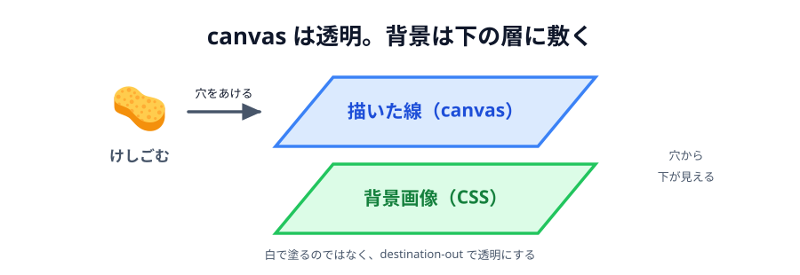
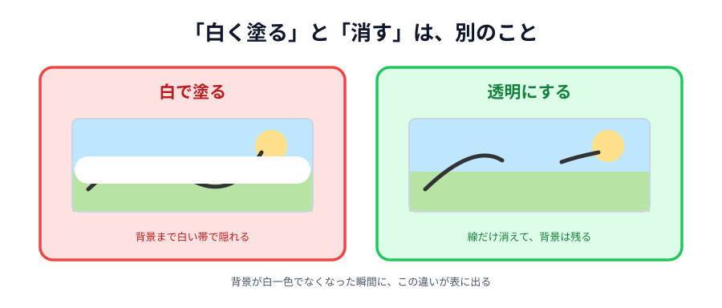

# 03 画像を背景に敷く



キャンバスの下に写真や地図を敷いて、その上から描けるようにします。
「この写真のここ！」と指させるようになります。

[05 章の完成コード](../../05-drawing/07-deploy/LECTURE.md)に、この機能だけを足したものが
ページの下に置いてあります。

> **今回さわる `app/`:** `style.css` に背景、`main.js` にけしごむの作り直し

## けしごむが壊れる

背景を敷くだけなら、`style.css` の 1 行で終わります。
問題はそのあとです。**けしごむが白い線を引く道具になっている**からです。

[05 章 05 節](../../05-drawing/05-eraser/LECTURE.md)では、背景が白一色だったので
「白で上塗り＝消えたように見える」で済んでいました。
背景が写真になったとたん、けしごむは**写真の上に白い線を引く道具**になります。



_図: 「白く塗る」と「消す」は、背景があると別のものになる。_

## 敷く

背景はキャンバスの中に描きません。**CSS でキャンバスの下に敷きます。**
キャンバス自体は透明なままにして、消したところから下の絵が透けるようにします。

:::code[`style.css` の `canvas`]{filepath=style.css offset=50}

```css
canvas {
  display: block;
  /* 背景はキャンバスの中身ではなく、CSS の背景画像として下に敷く。
     キャンバス自体は透明なので、消したところからこの絵が出てくる。 */
  background-image: url('assets/background.svg');
  background-size: cover;
  background-color: #eaf7ff;
  border-radius: 8px;
```

:::

画像は `app/assets/` に置きます。ここでは 800x600 の風景を用意しました。
自分の写真に差し替えても、`background-size: cover` が枠に合わせて拡大縮小してくれます。

::assets[背景画像をダウンロード]

:::notice
`ctx.drawImage()` でキャンバスの中に描く方法もあります。
そちらは `canvas.toDataURL()` で保存したときに背景も一緒に付いてくるのが利点ですが、
画像の読み込みを待つ処理と、「ぜんぶ消す」のたびに描き直す処理が要ります。
今回は敷くだけなので CSS を選びました。
:::

## 「消す」を指示として送る

いまのけしごむは、こういう指示を送っています。

```js
{ type: 'line', color: '#ffffff', width: 40 }
```

これを「白い線」ではなく「**消す線**」に変えます。

:::code[`main.js` の `pointermove` の中]{filepath=main.js offset=191}

```js
color: color,
width: tool === 'eraser' ? 40 : 4,
// 「白で塗って」ではなく「消して」と伝える。相手も同じように消す。
erase: tool === 'eraser',
```

:::

`color` は選んでいる色のまま送ります。消すときは色を使わないので、何が入っていても構いません。

## 消す道具として描く

キャンバスには「いま描いているものを、下にあるものとどう混ぜるか」の設定があります。
それが `globalCompositeOperation` です。
`destination-out` にすると、**描いたところが透明になります**。

:::code[`main.js` の `drawLine`]{filepath=main.js offset=127}

```js
function drawLine(x1, y1, x2, y2, lineColor, lineWidth, erase) {
  // destination-out は「描いたところを透明にする」モード。
  // 白で上塗りするのと違って、下に敷いた背景がそのまま出てくる。
  ctx.globalCompositeOperation = erase ? 'destination-out' : 'source-over';
  ctx.strokeStyle = lineColor;
  ctx.lineWidth = lineWidth;
  ctx.lineCap = 'round';
  ctx.beginPath();
  ctx.moveTo(x1, y1);
  ctx.lineTo(x2, y2);
  ctx.stroke();
  // 次に描くもののために、ふつうのモードへ戻しておく
  ctx.globalCompositeOperation = 'source-over';
}
```

:::

最後に `source-over`（ふつうに上へ重ねる）へ戻すのを忘れないでください。
この設定は**次に描くものにも残り続けます**。戻し忘れると、
そのあとのスタンプまで消しゴムとして働きます。

## `erase` を渡す

:::code[`main.js` の `apply` の中]{filepath=main.js offset=91}

```js
if (data.type === 'line') {
  drawLine(
    data.x1,
    data.y1,
    data.x2,
    data.y2,
    data.color,
    data.width,
    data.erase,
  );
}
```

:::

## 「ぜんぶ消す」も直す

白で塗りつぶすと、背景まで隠れてしまいます。透明に戻します。

:::code[`main.js` の `clearCanvas`]{filepath=main.js offset=149}

```js
function clearCanvas() {
  // 白で塗りつぶすのではなく、ぜんぶ透明に戻す。背景だけが残る。
  ctx.clearRect(0, 0, canvas.width, canvas.height);
}
```

:::

`clearRect` は「その範囲を透明に戻す」命令です。
`fillRect` が「塗る」なのに対して、こちらは「無かったことにする」です。

## 動かす

けしごむでなぞると、白い線ではなく**背景の風景が出てきます**。
「ぜんぶ消す」を押しても背景は残ります。

::preview[こちらで「へやをつくる」]{height="560"}

::preview[こちらで「へやにはいる」]{height="560"}

:::warning
背景の画像は、2 台とも同じものを持っている必要があります。
`app/` フォルダをそのまま公開しているので自動的にそろいますが、
片方だけ画像を差し替えると、同じ座標を指しても別の場所を指していることになります。
:::

::codeview{defaultFile="main.js"}
