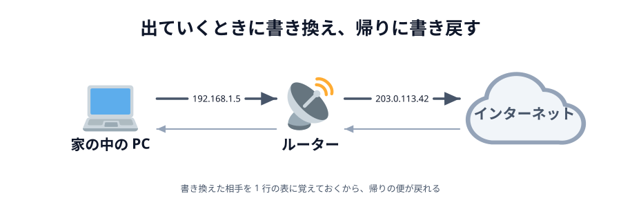
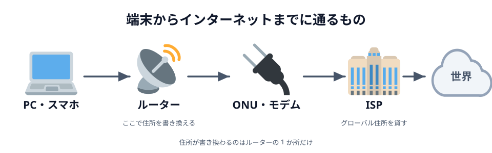
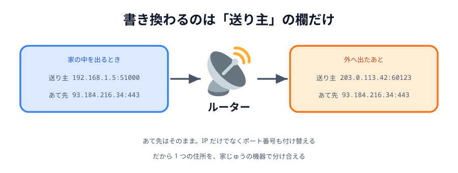
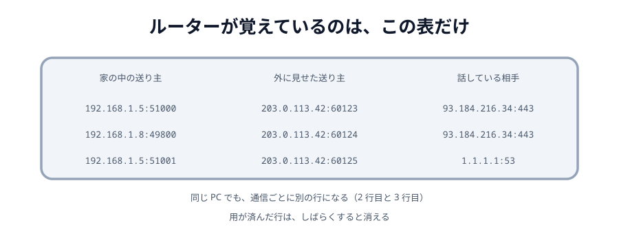
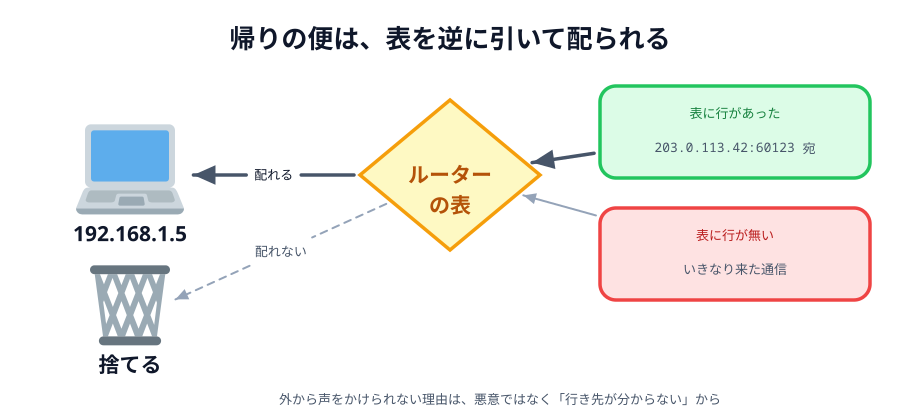

# 03 NAT とは何か



[04 章 02 節](../../04-how-it-works/02-webrtc/LECTURE.md)で、NAT を一言で片づけました。

> 家の中から外へ出ていく通信を、ルーターが自分の住所に**書き換えて**送り出し、
> 返ってきたものを元の機器へ**書き戻す**。

ここを開きます。**何を書き換えているのか**、**どうやって書き戻せるのか**、
そして**なぜ外から声をかけられないのか**。

コードは出てきません。読みものです。

## 家から出ていくまでに、いくつ機械を通るか

`https://example.com` を開いたとき、その通信は家の中で 2 つ、外で 1 つの機械を通ります。



_図: 住所が書き換わるのは、ルーターの 1 か所だけ。_

| 通るもの          | やっていること                                                     |
| ----------------- | ------------------------------------------------------------------ |
| PC・スマホ        | 家の中の番号（`192.168.1.5` など）を名乗って送り出す               |
| **ルーター**      | **送り主の欄を、外向けの住所に書き換える**。書き換えた組を表に残す |
| ONU・モデム       | 光やケーブルの信号に変換する。住所には触らない                     |
| ISP（プロバイダ） | 外から見える住所（グローバル IP）を貸している。その先へ中継する    |
| インターネット    | 相手のサーバーまで運ぶ                                             |

住所の話をしているのは**ルーターと ISP の 2 つだけ**です。
ISP は「この住所を使っていいですよ」と貸しているだけで、
実際に書き換えているのはルーターです。

:::notice
ルーターと ONU が 1 つの箱にまとまっている機種も多いので、家によっては見た目は 1 台です。
中でやっている仕事は別々です。
:::

## 書き換えているのは「送り主」の欄

通信には、荷物の伝票のように**送り主**と**あて先**が書いてあります。
どちらも「IP アドレス + ポート番号」の組です。



_図: あて先はそのまま。変わるのは送り主だけ。_

ルーターが書き換えるのは**送り主だけ**で、あて先には触りません。
そして、書き換えるのは IP アドレスだけではありません。**ポート番号も付け替えます**。

ここが肝心なところです。IP アドレスだけを付け替えたのでは、
家の中の PC とスマホが同時に同じサーバーへつないだときに、
どちらの返事なのか区別がつきません。
**ポート番号まで違うものを割り当てる**から、1 つの住所を家じゅうで分け合えます。

:::notice
IP だけを変換するものを NAT、ポート番号も一緒に変換するものを **NAPT**（IP マスカレード）と
呼び分けることがあります。家庭用ルーターがやっているのはほぼ全部 NAPT ですが、
日常ではまとめて NAT と呼びます。この節でも NAT と呼びます。
:::

## 覚えているのは、1 行の表

書き換えたら、**書き換えたことを覚えておく**必要があります。
覚えていなければ、返事が来たときに誰に渡せばいいのか分からなくなるからです。

ルーターはこの表を持っています。



_図: 通信 1 本につき 1 行。同じ PC でも、別の通信なら別の行になる。_

| 家の中の送り主      | 外に見せた送り主     | 話している相手      |
| ------------------- | -------------------- | ------------------- |
| `192.168.1.5:51000` | `203.0.113.42:60123` | `93.184.216.34:443` |
| `192.168.1.8:49800` | `203.0.113.42:60124` | `93.184.216.34:443` |
| `192.168.1.5:51001` | `203.0.113.42:60125` | `1.1.1.1:53`        |

1 行目と 2 行目を見てください。
PC とスマホが**同じサーバーの同じポート**につないでいますが、
外に見せたポート番号が `60123` と `60124` で違います。だから返事を取り違えません。

1 行目と 3 行目も同じ PC ですが、相手が違うので別の行です。
**表の行は「機器ごと」ではなく「通信ごと」**にできます。

この表には名前があって、**NAT テーブル**や**セッションテーブル**と呼ばれます。

## 帰りの便は、表を逆に引く

サーバーからの返事は、`203.0.113.42:60123` 宛でルーターに届きます。
ルーターは表の**真ん中の列**を探して、行が見つかれば左の列に書き戻して家の中へ流します。



_図: 外から声をかけられない理由は、悪意ではなく「行き先が分からない」から。_

つまり、**帰ってこられるのは「自分から出ていった通信の返事」だけ**です。

そして、いきなり外から `203.0.113.42:60123` に届いたものはどうなるか。
表に行が無ければ、ルーターは**どの機器に渡せばいいのか分からない**ので、捨てます。

これが 04 章で言った「外から中へは届かない」の中身です。
ルーターが意地悪をしているのでも、安全のために止めているのでもありません。
**行き先が書いていないから配れない**、それだけです。

:::notice
表の行は永久に残るわけではなく、しばらく通信が無いと消えます（数十秒〜数分）。
長くつなぎっぱなしにするアプリが、何も送ることが無くても定期的に小さなデータを
送っている（キープアライブ）のは、この行を消させないためです。
:::

:::warning
外に見せられるポート番号は 1 つの住所につき 65535 個しかありません。
家 1 軒ならまず足りますが、**ISP が 1 つのグローバル IP を何百軒もで共有させる**構成
（CGNAT。モバイル回線でよく使われます）だと、これが効いてきます。
:::

## ポートの決め方で、STUN が効いたり効かなかったりする

ここまでで「自分から出ていけば、その返事は帰ってこられる」ことが分かりました。
P2P はこの性質を使います。
[04 章 03 節](../../04-how-it-works/03-signaling/LECTURE.md)の **STUN** は、
「一度こちらから出ていって、外に見せた住所とポートを教えてもらう」道具でした。

教えてもらった `203.0.113.42:60123` を相手に伝えて、そこへ送ってもらう。
表に行があるので通る——**はずなのですが、通らない回線があります**。

分かれ目は、ルーターが外向けポートを**何ごとに**決めているかです。

| ルーターのやりかた | 外向けポートの決め方          | STUN で分かった住所に、別の相手から送れるか  |
| ------------------ | ----------------------------- | -------------------------------------------- |
| Cone 型            | **家の中の送り主ごと**に 1 つ | **送れる**。相手が違っても同じポートが使える |
| Symmetric 型       | **相手ごと**に別々            | **送れない**。相手が変わるとポートも変わる   |

Symmetric 型のルーターだと、STUN サーバーと話したときのポートと、
相手と話すときのポートが**別物**になります。
せっかく教えてもらった番号が、相手から見ると役に立ちません。

こうなると直接つなぐのはあきらめて、**TURN**（中継サーバー）を通すしかありません。
会社や学校、公衆 Wi-Fi でつながらないことがあるのは、たいていこれが理由です。
当日つながらなかったら**スマホのテザリングに切り替えてみる**、というのはここから来ています。

## 自分のルーターで見てみる

この表は、家庭用ルーターの管理画面でだいたい見られます。
ブラウザで `192.168.1.1` や `192.168.0.1` を開いて、
「NAT セッション」「セッション一覧」「接続状況」といった項目を探してください。
機種によっては見られないこともあります。

自分の PC 側で「いまどの通信を開いているか」を見るだけなら、ターミナルでも確認できます。

```sh
netstat -an | grep ESTABLISHED
```

ここに出てくるのは**書き換わる前**の住所（`192.168.1.5:51000` のほう）です。
ルーターがこれを何に書き換えたかは、PC 側からは分かりません。
04 章で言った「自分の外から見た住所を、自分では知らない」が、ここでも効いています。

:::questions

- ルーターが書き換えるのは、送り主とあて先の両方である [x]
- 1 つのグローバル IP を家じゅうで分け合えるのは、ポート番号も付け替えているから [o]
- NAT の変換表は、機器 1 台につき 1 行しかできない [x]
- 外からいきなり届いた通信が捨てられるのは、安全のために止めているから [x]
- 変換表の行は、しばらく通信が無いと消える [o]
- STUN で分かった住所が使えない回線がある [o]
- 自分の PC は、ルーターが自分を何番に書き換えたかを知っている [x]

:::

本編も付録も、ここまでです。おつかれさまでした。
