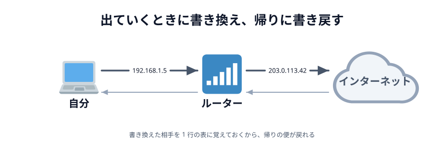
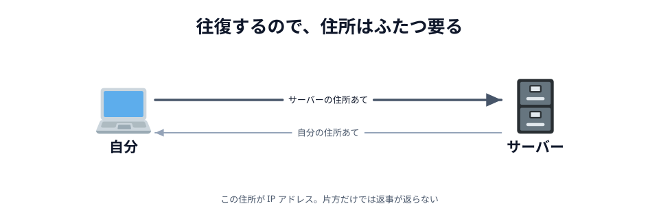
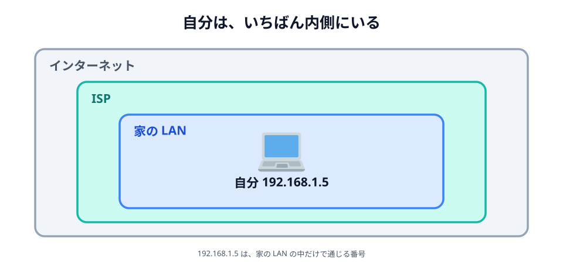
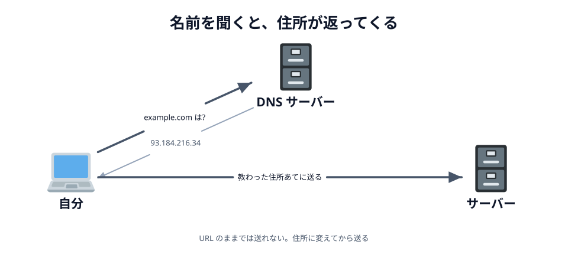
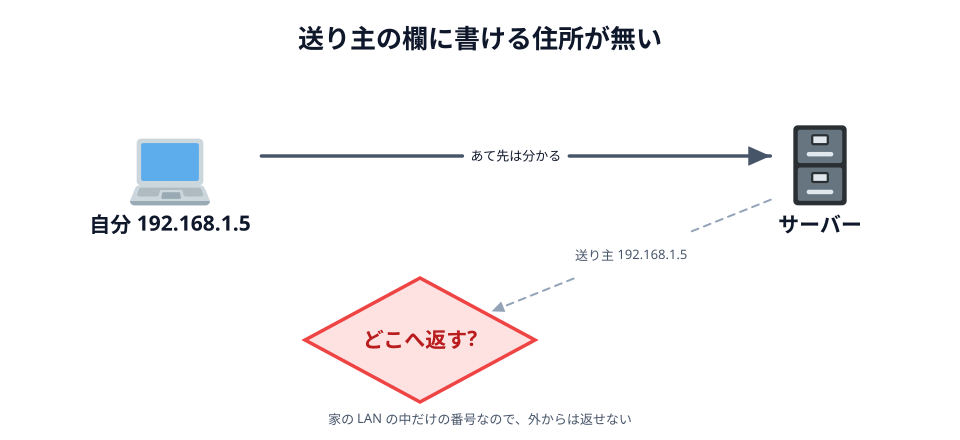
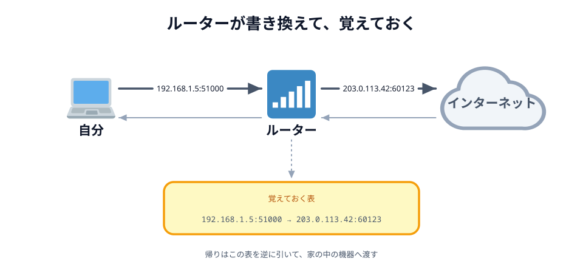

# 03 NAT とは何か

インターネットにつながっているのに、外から声をかけてはもらえない。その理由を見ます。

## IP アドレス

インターネットで通信するための住所です。行きと帰りがあるので、**あて先と送り主の両方**が要ります。

## ネットワークの階層

自分はインターネットに直接つながっていません。家の LAN の中にいて、その LAN は ISP の中にあります。
`192.168.1.5` は**家の中だけで通じる番号**です。

## URL から IP アドレス

`example.com` のままでは送れません。DNS サーバーに聞くと、相手の IP アドレスが分かります。

## 帰りの住所が書けない

あて先は分かりました。でも送り主の欄に書ける住所がありません。
家の中だけの番号を書いても、そこへは返せません。

## NAT が解決する

ルーターが送り主を**外向けの住所とポート番号**に書き換え、どの機器のどの通信かを表に覚えます。
返事が来たら表を引いて中へ渡す。これが階層のぶんだけ続いて、自分のところまで戻ってきます。

外から先に声をかけられないのは、その表にまだ行が無いからです。

ここまでです。おつかれさまでした。
