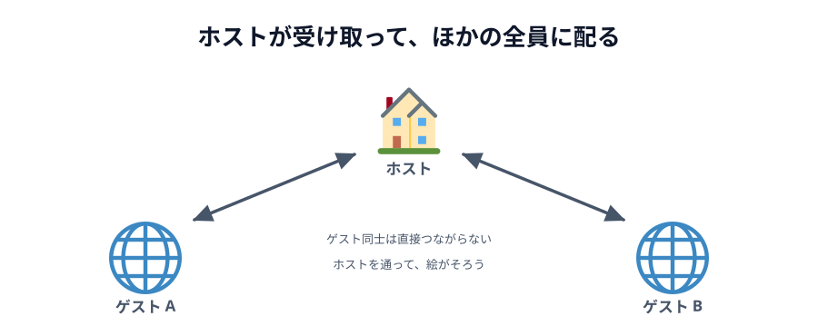
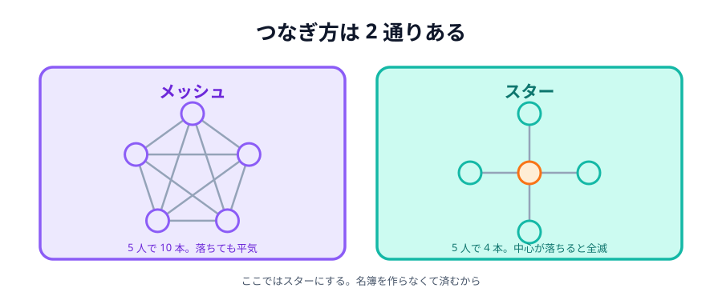

# 04 3 人以上でつなぐ



このおまけだけは、少しだけ設計の話になります。
`conn` を配列にするのはすぐですが、**誰が誰とつながるか**を決めないといけないからです。

[05 章の完成コード](../../05-drawing/07-deploy/LECTURE.md)に、この機能だけを足したものが
ページの下に置いてあります。

> **今回さわる `app/`:** `main.js` のつなぐところ全部（`index.html` と `style.css` はそのまま）

## つなぎ方を決める

3 人以上になると、つなぎ方は 2 通りあります。



_図: 線の数が違う。5 人ならメッシュは 10 本、スターは 4 本。_

**メッシュ**は全員が全員とつなぎます。誰かが落ちても残りは平気ですが、
人数が増えると線が一気に増えます（`n × (n − 1) ÷ 2` 本）。
それに「いま誰がいるのか」を全員に知らせる仕組みを自分で作らないといけません。

**スター**はホストにだけつなぎ、ホストが全員に配ります。
線は人数ぶんしか要らず、**あいことばを知っていればホストに届く**ので、名簿が要りません。
その代わり、ホストが閉じると全員が切れます。

ここでは**スター**にします。いまのコードからの距離がいちばん近いからです。

## `conn` を配列にする

:::code[`main.js`（`ctx` の下）]{filepath=main.js offset=10}

```js
// つながっている相手ぜんぶ。1 対 1 のときの conn を、そのまま配列にしたもの。
const conns = [];
```

:::

`let conn = null;` は消します。ここから先は「相手」ではなく「相手たち」を扱います。

## 何人でも受け入れる

ホスト側の `peer.on('connection')` は、**もともと何人でも呼ばれます**。
いままでは 1 つの `conn` に上書きしていたので、あとから来た人で前の人が消えていただけです。

:::code[`main.js` のホスト側]{filepath=main.js offset=36}

```js
// 何人でも入ってこられる。1 人来るたびに connection が呼ばれる。
peer.on('connection', function (conn) {
  conn.on('open', function () {
    ready(conn);
  });
});
```

:::

:::code[`main.js` のゲスト側]{filepath=main.js offset=50}

```js
peer.on('open', function () {
  const conn = peer.connect(roomId(wordInput.value));
  conn.on('open', function () {
    ready(conn);
  });
});
```

:::

どちらも `ready` に**その相手を渡す**形にします。
`conn.on('open', ready)` と書けないのは、`ready` が引数を受け取るようになったからです
（そのまま渡すと、PeerJS が渡してくる別のものが入ってしまいます）。

## つながった相手を 1 人ぶん受け持つ

:::code[`main.js` の `ready`]{filepath=main.js offset=74}

```js
// つながった相手を 1 人ぶん受け持つ。ホストでもゲストでも中身は同じ。
function ready(conn) {
  conns.push(conn);
  showCount();

  conn.on('close', function () {
    // 切れた相手を一覧から外す。
    // indexOf が -1 のときに splice すると別の相手が消えるので、必ず確かめる。
    const index = conns.indexOf(conn);
    if (index !== -1) {
      conns.splice(index, 1);
    }
    showCount();
  });

  conn.on('data', function (data) {
    apply(data);
    remember(data);
    // 届いた指示を、送ってきた本人いがいの全員にも配る。
    // これでホストが中継役になり、ゲスト同士の絵もそろう。
    send(data, conn);
  });

  // これまでの絵を、あとから来たこの相手にも見せる
  history.forEach(function (data) {
    conn.send(data);
  });
}
```

:::

`conn.on('data', apply)` だったところが増えています。届いた指示は、

1. 自分のキャンバスに描き（`apply`）
2. 記録に足し（`remember`）
3. **送ってきた本人いがいの全員に配る**（`send`）

の 3 つを通ります。3 番目が中継です。
ゲスト B が描いた線は、ホスト A を経由してゲスト C に届きます。

:::code[`main.js`（`ready` の下）]{filepath=main.js offset=103}

```js
function showCount() {
  statusText.textContent =
    conns.length === 0
      ? 'ぜんいん切れました'
      : conns.length + ' 人とつながっています';
}
```

:::

## 全員に送る

:::code[`main.js`（`showCount` の下）]{filepath=main.js offset=110}

```js
// つながっている全員に送る。except に渡した相手だけは飛ばす
// （送ってきた本人に、同じものを送り返さないため）。
function send(data, except) {
  conns.forEach(function (conn) {
    if (conn !== except) {
      conn.send(data);
    }
  });
}
```

:::

`except` がこの仕組みの要です。これが無いと、
届いた指示をそのまま送り返し、相手もまた送り返し……と**永久に往復します**。

:::warning
無限ループを止めているのは `except` だけです。これで足りているのは、
**ゲストがホストとしかつながっていない**（＝輪ができない）からです。
メッシュにすると輪ができるので、`except` では止まりません。
指示ひとつひとつに ID を振って「見たことがあるものは配らない」を足す必要があります。
:::

## 記録を分ける

いままで `history` に貯めていたのは「**自分が**出した指示」でした。
中継するようになると、それでは足りません。
ゲスト B が描いた線をホスト A が覚えていないと、あとから来た C には見えないからです。

:::code[`main.js`（`send` の下）]{filepath=main.js offset=120}

```js
// 自分が出した指示も、届いた指示も、ぜんぶ覚えておく。
// あとから入ってきた人には、この記録をまとめて送る。
function remember(data) {
  if (data.type === 'clear') {
    history.length = 0;
  } else {
    history.push(data);
  }
}
```

:::

:::code[`main.js` の `draw`]{filepath=main.js offset=144}

```js
// 自分のキャンバスに描いてから、同じ指示を「つながっている全員」に送る。
// 相手が 0 人でも、send は何もしないだけなので、そのまま呼んでよい。
function draw(data) {
  apply(data);
  remember(data);
  send(data, null);
}
```

:::

`if (conn)` が消えたことに注目してください。
つながっていなければ `conns` が空なので、`send` は何もしません。条件が要らなくなりました。

ゲストも届いた指示を `remember` していますが、
ゲストが `history` を送るのは**自分がホストにつないだ瞬間の 1 回だけ**で、
そのとき `history` はまだ空です。だから二重に流れることはありません。

## 動かす

**3 つ**ブラウザのタブを開いてください（プレビューは 2 つしか置けないので、
[公開した URL](../../05-drawing/07-deploy/LECTURE.md) を 3 つのタブで開くのが早いです）。

1. 1 つめで「へやをつくる」
2. 2 つめ・3 つめで、同じあいことばで「へやにはいる」
3. 2 つめで描く → 1 つめにも 3 つめにも出る

ホストの表示が「2 人とつながっています」になれば成功です。

::preview[こちらで「へやをつくる」]{height="560"}

::preview[こちらで「へやにはいる」]{height="560"}

:::warning
ホストが閉じると全員切れます。**ホストが落ちても続く**ようにするには、
残った誰かが新しいホストになる仕組みが要ります。
そこまで来ると、素直にサーバーを立てたほうが早くなります。
P2P が向いているのはこのあたりまで、という線が引けるところです。
:::

::codeview{defaultFile="main.js"}
