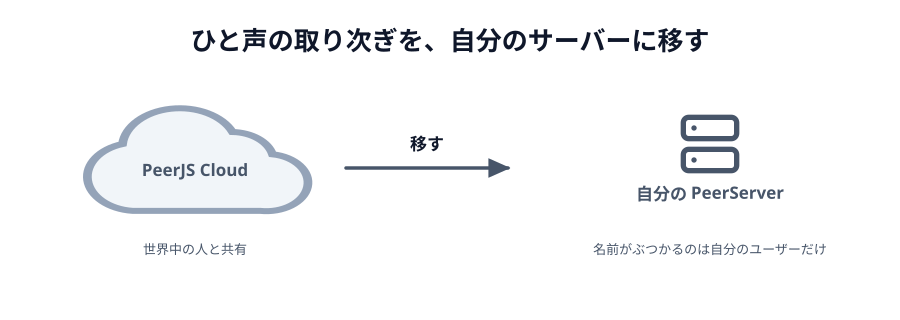
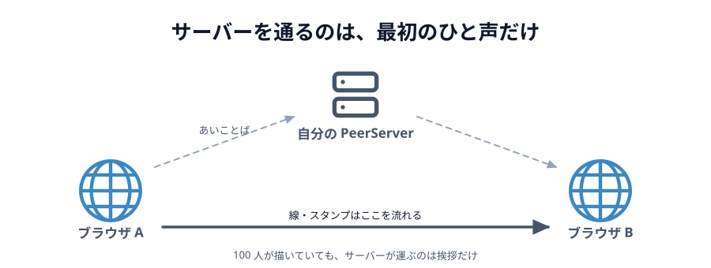

# 05 自分の PeerServer を立てる



ここまで、あいことばの受け渡しは **PeerJS Cloud** に任せていました。
これを自分のサーバーに置きかえます。

このページだけは、動かすのにターミナルを使います。

> **今回さわる `app/`:** `main.js` の `new Peer(...)` 2 か所だけ

## なぜ立てるのか

[01 章 03 節](../../01-introduction/03-peerjs-cloud/LECTURE.md)で見たとおり、
PeerJS Cloud は**世界中の人と共有している 1 つのサーバー**です。困るのは主に 2 つです。

- **あいことばが世界と共通**。`webrtc-handson-` という長い前置きを付けてしのいでいましたが、
  自分のサーバーなら、名前がぶつかる相手は自分のユーザーだけです
- **止まったら何もできない**。落ちているかどうかを自分では直せません

自分で立てれば、どちらも自分の管理下に入ります。

## 立てるのは「ひと声」の場所だけ

先に、立てなくてよいものをはっきりさせておきます。



_図: つながったあとの線は、サーバーを通らない。_

PeerServer が扱うのは、[04 章 02 節](../../04-how-it-works/02-signaling/LECTURE.md)で見た
**シグナリング**だけです。つながったあとの線・スタンプは、2 台のあいだを直接流れます。

だから自分で立てても、**サーバーの通信量はほとんど増えません**。
100 人が絵を描いていても、サーバーが運ぶのは最初の挨拶だけです。

:::notice
一方で、つながらない回線の救済（TURN）は別の話です。
そちらは通信をまるごと中継するので、通信量がそのままサーバー費用になります。
[次のページ](../06-turn/LECTURE.md)で扱います。
:::

## 手元で動かす

インストールは要りません。`npx` で 1 行です。

```sh
npx peer --port 9000 --key peerjs
```

こう出れば動いています。

```
Started PeerServer on ::, port: 9000, path: /
```

:::warning[パッケージ名は `peer`、コマンド名は `peerjs`]
ブラウザ側で読み込んでいるライブラリが `peerjs`、サーバーが `peer` です。名前が逆立ちしています。
`npx peerjs` と打つとクライアント用のライブラリが落ちてきて、実行できるものが無いと言われます。
:::

## つなぎ先を変える

`main.js` の `new Peer(...)` は 2 か所（ホスト側とゲスト側）にあります。
どちらにも同じ設定を渡します。

```js
// ホスト側
const peer = new Peer(roomId(wordInput.value), {
  host: 'localhost',
  port: 9000,
  path: '/',
  key: 'peerjs',
  // 手元の http で動かすので、暗号化なしでつなぐ
  secure: false,
});

// ゲスト側
const peer = new Peer({
  host: 'localhost',
  port: 9000,
  path: '/',
  key: 'peerjs',
  secure: false,
});
```

同じものを 2 回書くのが気持ち悪ければ、上のほうにまとめておきます。

```js
// つなぎ先の設定。ここを 1 か所直せば、Cloud と自前サーバーを行き来できる。
const server = {
  host: 'localhost',
  port: 9000,
  path: '/',
  key: 'peerjs',
  secure: false,
};

// 使うときは
const peer = new Peer(roomId(wordInput.value), server);
```

これで、あいことばの受け渡しは自分のサーバーを通ります。
`npx peer` を止めると新しくつなげなくなり、`Ctrl+C` のあとに
`つながりませんでした（network）` が出れば、ちゃんと自分のサーバーを見ています。

## 2 台で試すとき

`localhost` は「この PC」という意味なので、**スマホからは届きません**。
同じ Wi-Fi の中で試すなら、PC の LAN アドレス（`192.168.x.x`）を使います。

```sh
# PC の LAN アドレスを調べる（Mac）
ipconfig getifaddr en0
```

出てきた住所を `host` に書き、ページも `file://` ではなく
その住所で開く必要があります（`http://192.168.1.5:8080/` など）。

```js
const server = {
  host: '192.168.1.5',
  port: 9000,
  path: '/',
  key: 'peerjs',
  secure: false,
};
```

## インターネットに置くとき

手元で動いたら、次はどこかに置く番です。ここで 2 つ引っかかります。

**1 つめ。Netlify Drop には置けません。**
PeerServer は Node のプロセスが**動き続ける**必要があります。
Netlify Drop が配るのはファイルだけなので、置き場所が別に要ります
（VPS、Render、Fly.io、Railway など、Node をずっと動かせるところ）。

**2 つめ。`https` のページからは `https` のサーバーにしかつなげません。**
Netlify で公開したページは `https` です。そこから `http` の PeerServer につなぐと、
ブラウザが**混在コンテンツとして止めます**。証明書を用意して `secure: true` にします。

```js
const server = {
  host: 'peer.example.com',
  port: 443,
  path: '/',
  key: 'peerjs',
  secure: true,
};
```

## Node のコードとして書く

`npx` ではなくアプリの一部にするなら、`peer` パッケージを直接使います。

```sh
npm install peer
```

```js
// server.js
import { PeerServer } from 'peer';

PeerServer({
  port: 9000,
  path: '/',
  // 相手が黙ってから切るまでの時間（ミリ秒）
  alive_timeout: 60000,
});
```

`allow_discovery: true` を足すと、
`http://localhost:9000/peerjs/peers` で**いま接続中の ID 一覧**が取れます。

```js
PeerServer({ port: 9000, path: '/', allow_discovery: true });
```

[3 人以上でつなぐ](../04-multi/LECTURE.md)で「誰がいるか分からない」問題に当たりましたが、
自分のサーバーならこの一覧が使えます。
ただし**誰でも読める**ので、公開するなら認証を付けてください。

:::warning
`key` は合言葉ではなく、ただの名前空間の区切りです。認証にはなりません。
本当に閉じたいなら、PeerServer を Express に組み込んで（`ExpressPeerServer`）、
その前段でログイン済みかを確認します。
:::

## 何が変わって、何が変わらないか

|                      | PeerJS Cloud                   | 自分の PeerServer               |
| -------------------- | ------------------------------ | ------------------------------- |
| あいことばの重複     | 世界中の人と共有               | 自分のユーザーの中だけ          |
| 止まったとき         | 待つしかない                   | 自分で直せる                    |
| 費用                 | 無料                           | サーバー代（小さい）            |
| つながったあとの通信 | **直接**（サーバーを通らない） | **直接**（同じ）                |
| つながらない回線     | 救えない                       | **救えない**（TURN が別に要る） |

最後の行が大事なところです。
自分のサーバーを立てても、[つながらない回線](../../04-how-it-works/03-my-route/LECTURE.md)は救えません。
それは次のページの話です。
