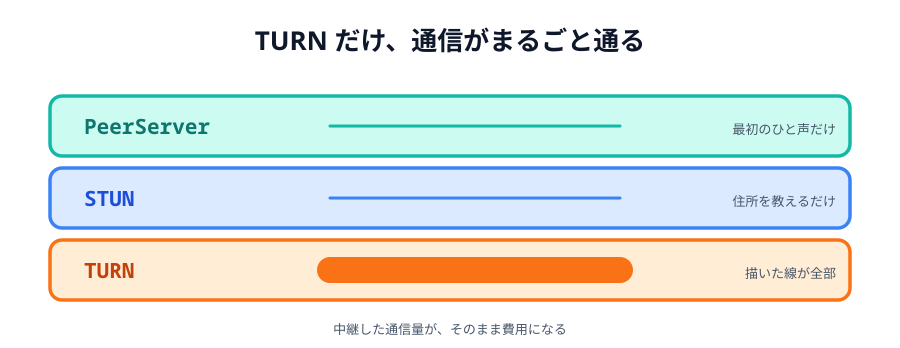
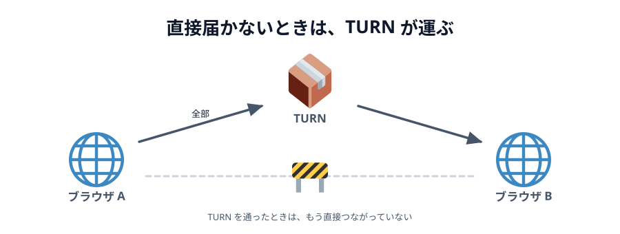

# 06 TURN を用意する



[04 章 02 節](../../04-data/02-trouble/LECTURE.md)で、
「会社のネットワークだとつながらないことがある」「PeerJS の既定の TURN はもう生きていない」
という話をしました。その最後の一手を、実際に用意します。

このおまけだけは、コードよりも**お金と運用**の話が多くなります。

> **今回さわる `app/`:** `main.js` の `new Peer(...)` に `config` を渡すだけ

## どこに効くのか

先に整理しておきます。P2P には、性格の違うサーバーが 3 つ出てきます。

|                | 役目                         | 通信量       | 無いとどうなる             |
| -------------- | ---------------------------- | ------------ | -------------------------- |
| **PeerServer** | 最初のひと声を取り次ぐ       | ごくわずか   | 相手を見つけられない       |
| **STUN**       | 外から見た自分の住所を教える | ごくわずか   | 相手に住所を伝えられない   |
| **TURN**       | **通信をまるごと中継する**   | **全部通る** | つながらない回線が救えない |

TURN だけ、性格がまったく違います。
[前のページ](../05-peerserver/LECTURE.md)の PeerServer は
「100 人いても挨拶だけ」でしたが、TURN は**描いた線が全部そこを通ります**。
だから無料で開放しているところが、ほぼ存在しません。



_図: TURN を通ったときは、もう直接つながっていない。_

## 渡し方

コードは 1 か所です。`new Peer(...)` に `config` を渡します。

```js
const peer = new Peer(roomId(wordInput.value), {
  config: {
    iceServers: [
      // STUN も自分で書く（下の注意を参照）
      { urls: 'stun:stun.l.google.com:19302' },
      {
        urls: 'turn:turn.example.com:3478',
        username: 'あなたのユーザー名',
        credential: 'あなたのパスワード',
      },
    ],
  },
});
```

ホスト側とゲスト側の両方に渡します。
[前のページ](../05-peerserver/LECTURE.md)と同じで、上のほうにまとめておくと楽です。

:::danger[`config` を渡すと、既定の設定は消えます]
`iceServers` は**足されるのではなく、置きかわります**。
TURN だけ書いて STUN を書かないと、STUN が使えなくなり、
本来なら直接つながったはずの相手まで TURN 経由になります。
中継はお金がかかるので、これは静かに財布に効きます。
:::

## 用意する

**買う**か、**立てる**かです。

### 買う

- **Cloudflare Calls** … 使った通信量に対する課金。無料枠があります
- **Twilio Network Traversal Service** … GB 単位の課金。老舗です
- **Metered** … TURN 専業。無料枠があります

管理画面でユーザー名とパスワードが発行されるので、上のコードに書き込むだけです。

### 立てる

定番は [coturn](https://github.com/coturn/coturn) です。VPS 1 台で動きます。

```sh
# Ubuntu
sudo apt install coturn
```

```ini
# /etc/turnserver.conf
listening-port=3478
tls-listening-port=5349
# 外から見たこのサーバーの住所
external-ip=203.0.113.10
realm=turn.example.com
# 認証を使う
lt-cred-mech
user=myuser:mypassword
```

開けるポートは `3478`（UDP と TCP）と、TLS を使うなら `5349` です。
それに加えて、中継に使う高い番号のポート（既定では `49152`〜`65535` の UDP）も要ります。

:::warning
ファイアウォールで中継用のポート範囲を開け忘れるのが、いちばん多いつまずきです。
`3478` だけ開けても、認証は通るのに中継が始まりません。
`min-port` / `max-port` で範囲を狭めて、そのぶんだけ開けるのが現実的です。
:::

## パスワードをページに書かない

上のコードには問題があります。**パスワードがブラウザから丸見えです。**
`main.js` を開けば誰でも読めるので、あなたの TURN を他人が使えます。中継はお金がかかります。

本番では、**短い時間だけ有効な認証情報**をサーバー側で作って渡します。
coturn なら `use-auth-secret` と `static-auth-secret` を設定して、こう作ります。

```js
// サーバー側（Node）。ブラウザには置かない。
import crypto from 'node:crypto';

function makeCredential(secret, seconds) {
  // ユーザー名は「期限のタイムスタンプ」そのもの
  const username = String(Math.floor(Date.now() / 1000) + seconds);
  const credential = crypto
    .createHmac('sha1', secret)
    .update(username)
    .digest('base64');

  return { username, credential };
}
```

ブラウザは、ページを開いたときにこれを取りに行きます。

```js
const res = await fetch('/api/turn-credential');
const { username, credential } = await res.json();

const peer = new Peer(roomId(wordInput.value), {
  config: {
    iceServers: [
      { urls: 'stun:stun.l.google.com:19302' },
      { urls: 'turn:turn.example.com:3478', username, credential },
    ],
  },
});
```

盗まれても、数時間で切れます。
買う場合も、たいてい同じ仕組み（短命の認証情報を発行する API）が用意されています。

## 効いているか確かめる

[04 章 02 節のデモ](../../04-data/02-trouble/LECTURE.md)をもう一度使います。
`config` に自分の TURN を入れた状態で走らせて、
**`relay` が「見つかった」に変われば成功**です。

そこまで行かずに詰まったときは、どこで止まっているかで切り分けます。

- **`relay` が出ない** … 認証が通っていないか、中継用ポートが閉じています
- **`relay` は出るのにつながらない** … 相手側の回線が TURN に届いていません（両方に要ります）
- **いつも `relay` になる** … STUN を書き忘れています（上の `:::danger` を参照）

:::notice
Google の [Trickle ICE](https://webrtc.github.io/samples/src/content/peerconnection/trickle-ice/)
に TURN の住所と認証情報を入れると、ブラウザだけで同じ確認ができます。
アプリを直す前に、まずここで `relay` が出るか見るのが早道です。
:::

## いくらかかるか

中継した通信量がそのまま費用です。
このお絵かきツールが送っているのは座標だけなので、実はとても軽いです。

```js
{ type: 'line', x1: 120, y1: 80, x2: 124, y2: 86, color: '#333333', width: 4 }
```

これで 100 バイト弱。1 秒に 60 回送っても 6 KB/秒、
1 時間なぞり続けて 20 MB くらいです。**文字と座標だけなら、TURN は怖くありません。**

怖いのはビデオ通話です。1 人あたり数 Mbps が中継サーバーを通ります。
「TURN は高い」と言われるのは、たいていそちらの話です。

## ここまで来たら

TURN を用意し、PeerServer を立て、3 人以上をつなぐ——ここまで来ると、
運用するものが 2 つ増えています。

そうなると「最初からサーバーを 1 台立てて、そこに全員つないだほうが早いのでは」
という考えが出てきます。**そのとおりです。**
[02 章 01 節](../../02-how-it-connects/01-server-vs-p2p/LECTURE.md)で見た
サーバー経由と P2P の比較が、ここでまた効いてきます。

P2P が気持ちよく効くのは、

- 人数が少ない（2 人〜数人）
- 遅れが少ないほうが嬉しい
- 内容をサーバーに残したくない
- サーバー代をかけたくない

このあたりが重なるときです。
このハンズオンで作ったものは、まさにその真ん中にありました。
